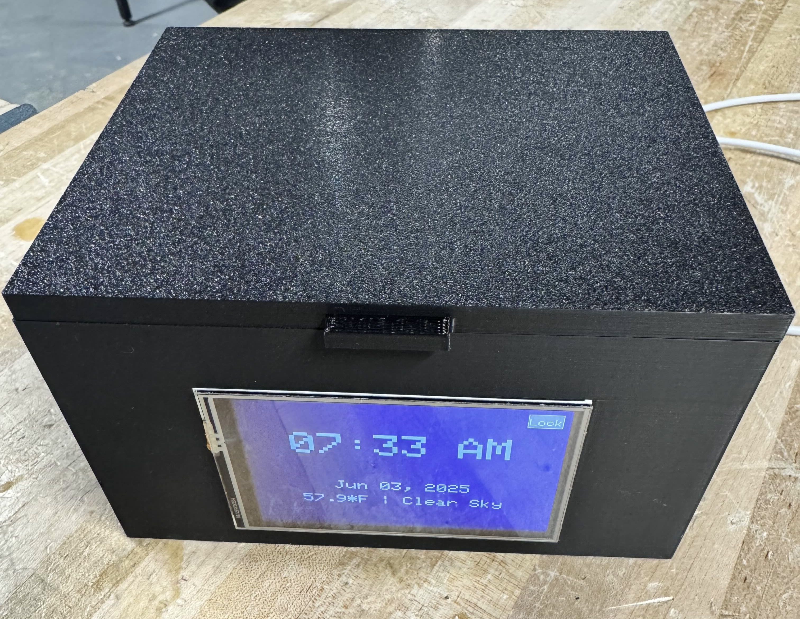
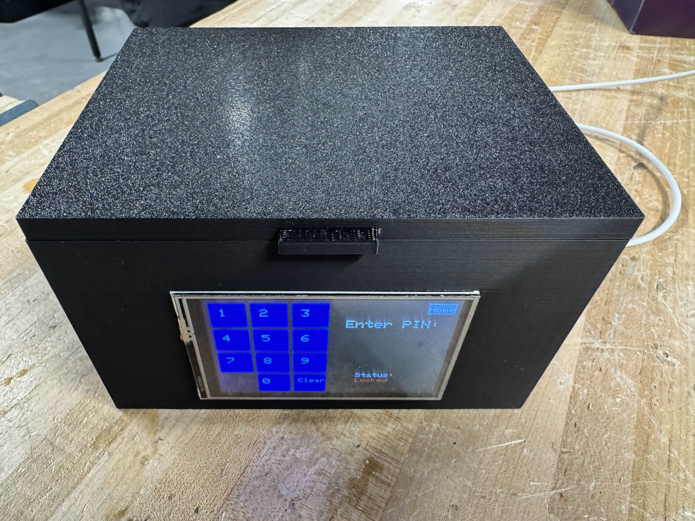

# smart-clock-lockbox
A smart clock display with a built in lockbox using an ESP32 and solenoid lock

ESP32 Display: https://www.amazon.com/dp/B0D93MBWC2

Solenoid lock: https://www.amazon.com/dp/B0C793X21J

Other components needed: 5V relay, 9V battery, misc. wiring.

Clock/Weather display page

Pinpad page

Inside layout

Directions:
1. In clockLock.ino replace your Wifi credentials and lat/longitude
2. Using the Arduino IDE, upload clockLock.ino to the ESP32

Electrical directions:
1. 
